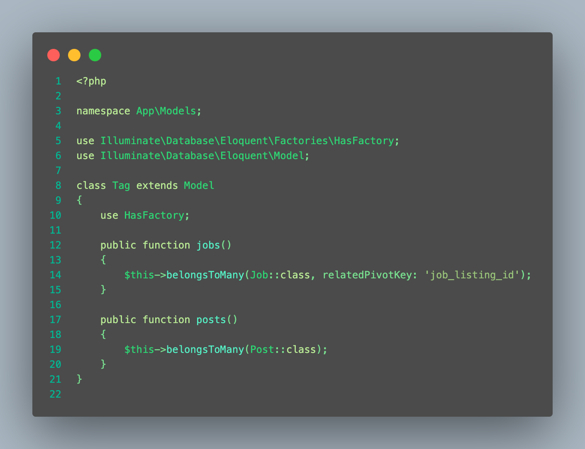
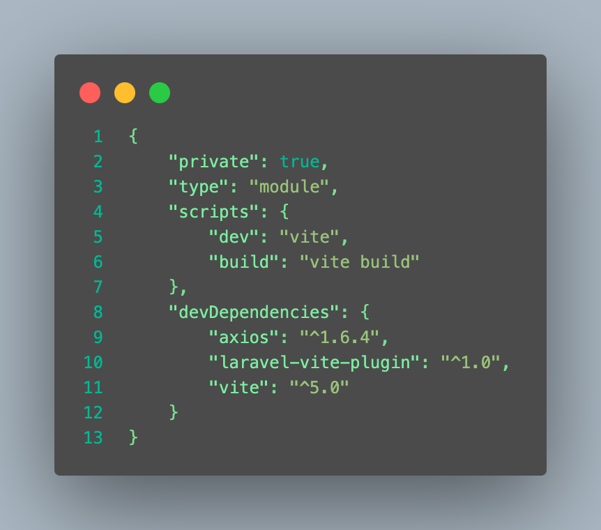
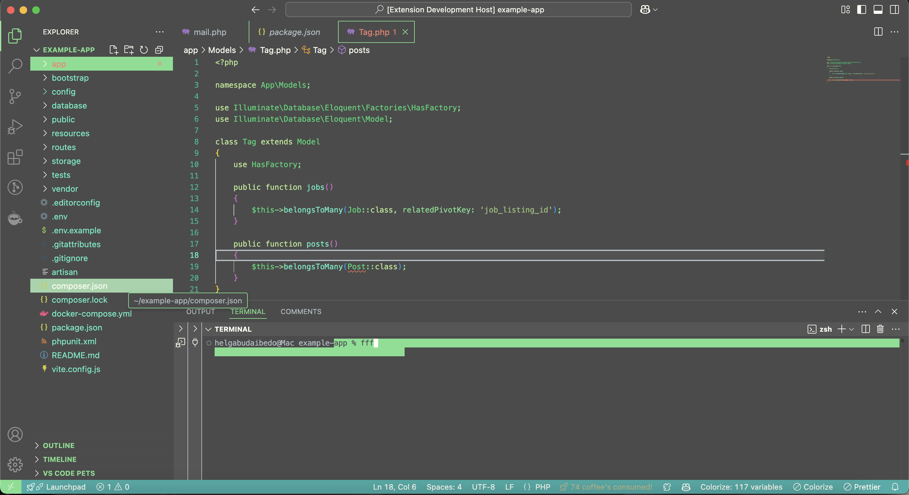

# Welcome to Foggy Forest color theme

After debuting with my first light theme... I thought it's time to make something similarly pleasant but in dark mode. So Foggy Forest happened, with its calming atmopshere, mainly with shades of green and some blue.

I find it very relaxing to look at, hopefully you'll enjoy it too :)

## Installation
Simply click on the install button and all should be set.
The extension is available for free on [Visual Studio Code Marketplace](https://marketplace.visualstudio.com/manage/publishers/kartoffelente/extensions/sunset-serenade/hub?_a=acquisition).

[Git repo](https://github.com/helheim0/foggy-forest)
You can report any issues, suggestions [here](https://github.com/helheim0/foggy-forest/issues).
## Example screenshots

**Enjoy and tell me what you think!**
